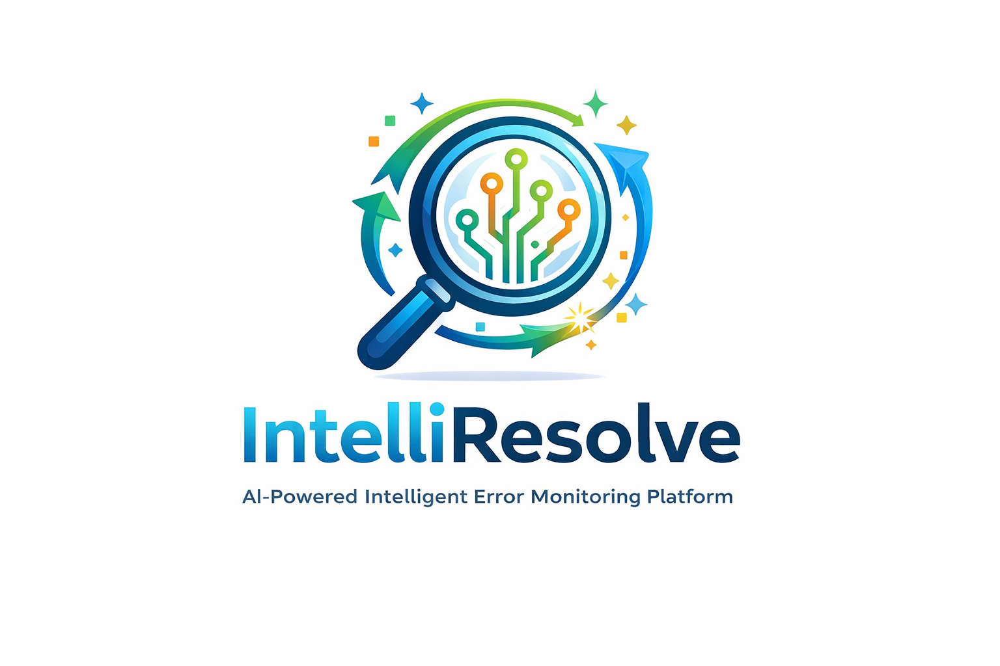

# 🚀 IntelliResolve

<p align="center">
  
</p>

<p align="center">
  <b>AI-Powered Intelligent Error Monitoring Platform</b>
</p>

<p align="center">
  
  
  
  
</p>

---

## 🔍 Overview

IntelliResolve is an **AI-based log monitoring system** that detects anomalies, prioritizes critical issues, and suggests intelligent fixes.

It helps organizations shift from **reactive troubleshooting → proactive monitoring**.

---

## ✨ Key Features

- 🤖 AI-based anomaly detection  
- ⚠️ Severity classification  
- 💡 Smart fix suggestions  
- 📊 Interactive dashboard  
- 📁 Log file upload  
- 🧠 AI assistant for troubleshooting  

---

## 🧠 How It Works

1. Upload system logs  
2. AI analyzes log patterns  
3. Detects anomalies  
4. Classifies severity  
5. Suggests fixes  
6. Displays results on dashboard  

---

## 🛠️ Tech Stack

| Technology | Usage |
|----------|------|
| Python | Core logic |
| Streamlit | UI Dashboard |
| Pandas | Data handling |
| Scikit-learn | AI model |

---

## ⚙️ Installation & Run

```bash
pip install -r requirements.txt
streamlit run app.py
